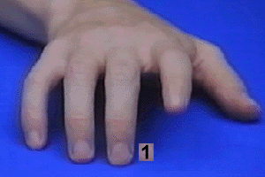
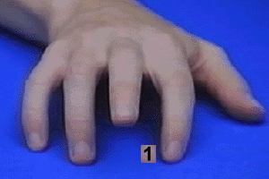
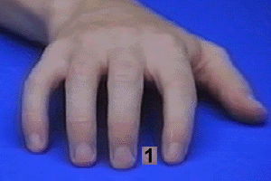

# Automatic Imitation Task

This repository hosts the scrips and stimuli for an automatic imitation paradigm using PsychToolBox for Matlab. 

## Design

This experiments then aims to investigate the proposed connection between the presentation timing and the processing speed/accuracy of the cognitively-taxing task.

The participant sits in front of the experiment computer and holds to keys down with his index and middle fingers to start a trial. The participant is then presented with images of a hand that lifts either of the two fingers or remains calm. 

### Congruency
Together with the stimulus the participant is presented with a digit cue indicating the finger that the participant has to release from the keyboard. There are **congruent** (hand no screen lifts the same finger as indicated with the cue), **incongruent** (cue and stimulus fingers don't match), and **neutral** (hand remains calm) trials.

 _Congruent stimulus_  

 _Incongruent stimulus_

 _Neutral stimulus_

### Synchrony
In addition to the congruency of stimulus and cue, the presentation timing is manipulated depending on the participant's heartbeat. Using a ECG that feeds into a custom Arduino, we can measure the participant's **R peak** and then reliably predict the next occurance of that peak. Using a conversion formula, we then estimate that a stimulus presented **250 ms** after the R peak lies within the **systole**, whereas a stimulus presented **550 ms** lies within the **diastole**. 

